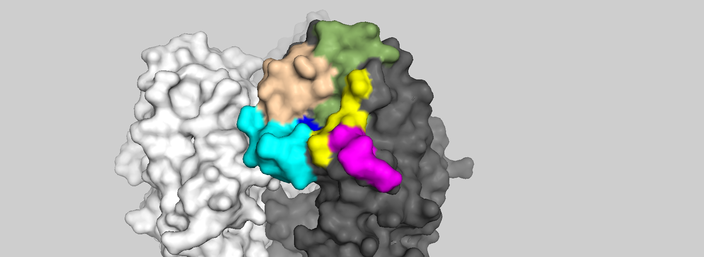
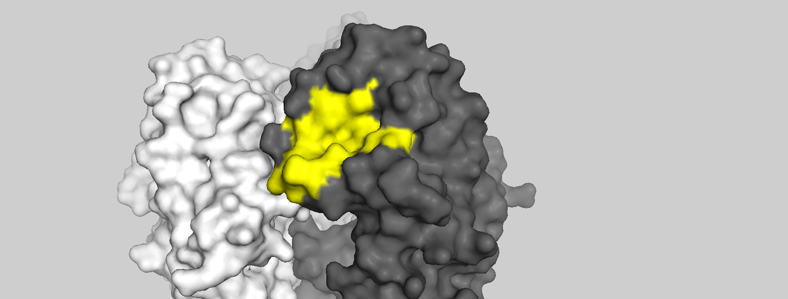

# Info:

This is a Gyrfalcon structure. 

# Color coding:

Image1: Yellow: blue: 90 loop, 130 loop, Pink: 140 loop, Green: 150 loop, beige: 190 helix, cyan: 220 loop (combination of different sources, check [2],[3]). These are the secondary structures that contains RBS residues.

Image2: Yellow: RBS sites marked as in [1] (Bjorns paper). See also 

See also

[Indonesia](../A_Indonesia_5_2005/README.md)

# Dependencies:
.pse files can be opened with pymol (see: https://pymolwiki.org/index.php/Linux_Install)

references:

1- Antigenic Variation of Clade 2.1 H5N1 Virus Is Determined by a Few
Amino Acid Substitutions Immediately Adjacent to the Receptor
Binding Site 

2- The structure and function of the hemagglutinin membrane glycoprotein of influenza virus

3- Structure and receptor binding of the hemagglutinin from a
human H6N1 influenza virus
